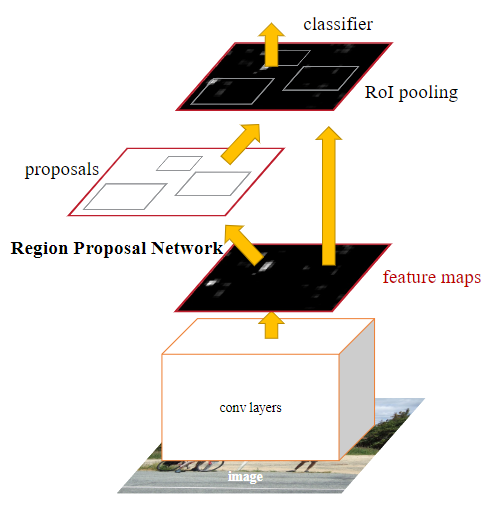

# 目标检测部分

## 一、目标检测背景知识

目标检测任务是找出图像或视频中人们感兴趣的物体，并同时检测出它们的位置和大小(Bouding box)。不同于图像分类任务，目标检测不仅要解决分类问题，还要解决定位问题，是属于Multi-Task的问题。


目标检测的发展脉络可以划分为两个周期：

- 传统目标检测算法时期(1998年-2014年)
- 基于深度学习的目标检测算法时期(2014年-至今)


### 传统目标检测算法

不同于现在的卷积神经网络可以自动提取高效特征进行图像表示，以往的传统目标检测算法主要基于手工提取特征。传统检测算法流程可概括如下：

  1. 选取感兴趣区域，选取可能包含物体的区域
  2. 对可能包含物体的区域进行特征提取
  3. 对提取的特征进行检测分类

基于手工提取特征的传统目标检测算法主要有以下三个缺点：

 1. 识别效果不够好，准确率不高
 2. 计算量较大，运算速度慢
 3. 可能产生多个正确识别的结果

经典传统目标检测算法：
    Viola-Jones(VJ)  detector（2001），Histogram of Oriented Gradients (HOG) Detector（2005）， Deformable Part-based Model (DPM)（2008，2010）

尽管现在基于深度学习的检测器在精度方面已经远远超过了传统检测器，但在他们身上仍然能看到许多来自传统检测器的影响，例如：混合模型，困难样本挖掘，边界框回归等。

### 基于深度学习目标检测算法

这里主要针对最近几年发展比较快的基于深度学习的目标检测算法。经过近7年的发展，目标检测的算法抽象成三个惯用的组件：Backbone, Neck, Head(DenseHead, RoIHead)。

1. Backbone用于特征提取。
2. Neck进行高低层特征的传递与融合，此外还起到重要的“分而治之”作用。
3. Head进行最终的预测。


## 二、Questions

### 1、Faster-Rcnn网络

#### （1）请介绍一下faster R-CNN网络的原理（注: 需要能够详细画出网络结构图）<顺丰-一面(2018)、腾讯-一面(2018)、旷视-三面（2018）>
Faster R-CNN是一种两阶段（two-stage）方法,它提出的RPN网络取代了选择性搜索（Selective search）算法后使检测任务可以由神经网络端到端地完成。

在结构上，Faster RCNN将特征抽取(feature extraction)，候选区域提取（Region proposal提取），边框回归（bounding box regression），分类（classification）都整合在了一个网络中，使得综合性能有较大提高，在检测速度方面尤为明显。


#### （2）请简要叙述一下"R-CNN——faster R-CNN"
1. R-CNN。
   - 首先通过传统的 selective search 算法在图片上预取 2000 个左右 Region Proposal；
   
   - 接着将这些 Region Proposal 通过前处理统一尺寸输入到 CNN 中进行特征提取；
   
   - 然后把所提取的特征输入到 SVM 支持向量机中进行分类；
   
   - 最后对分类后的 Region Proposal 进行 bbox 回归。
    此时算法的整个过程较为繁琐，速度也较慢。
2. Fast R-CNN。
   - 首先通过传统的 selective search 算法在图片上预取 2000 个左右 Region Proposal；
   - 接着对整张图片进行特征提取；
   - 然后利用 Region Proposal 坐标在 CNN 的最后一个特征图上进去 RoI 特征图提取；
   - 最后将所有 RoI 特征输入到分类和回归模块中。
    此时算法的整个过程相比 R-CNN 得到极大的简化，但依然无法联合训练。
2. Faster R-CNN。
   - 首先通过可学习的 RPN 网络进行 Region Proposal 的预取；
   - 接着利用 Region Proposal 坐标在 CNN 的特征图上进行 RoI 特征图提取；
   - 然后利用 RoI Pooling 层进行空间池化使其所有特征图输出尺寸相同；
   - 最后将所有特征图输入到后续的 FC 层进行分类和回归。
    此时算法的整个过程一气呵成，实现了"端到端"训练。

#### （3）faster R-CNN是经典的two-stage 检测器，请简单说明其中two-stage的含义。
   faster R-CNN之所以叫做 two-stage 检测器，原因是其包括一个区域提取网络 **RPN** 和 一个RoI Refine 网络 **R-CNN**(检测网络)，同时为了将 RPN 提取的不同大小的 RoI 特征图组成 batch 输入到后面的 R-CNN 中，在两者中间还插入了一个 RoI Pooling 层，可以保证任意大小特征图输入都可以变成指定大小输出。即在RPN提取ROI区域后，送入检测网络再进行分类和回归。
   

#### （4）请简要说明一下RPN（Region Proposal Network）网络的作用、实现细节<上交苏研院-二面（2020）、旷视-交叉面（2019）>
  - **RPN网络的作用：**
     -  RPN专门用来提取候选框，一方面RPN耗时少，另一方面RPN可以很容易结合到Fast RCNN中，成为一个整体。
   - **RPN网络的实现细节：**
      - 1个特征图（Faster RCNN的公共Feature Map）经过sliding window处理，得到256维特征，对每个特征向量做两次全连接操作，一个得到2个分数，一个得到4个坐标{然后通过两次全连接得到结果2k个分数和4k个坐标[k指的是由锚点产生的K个框(K anchor boxes)]}

     - 2个分数，即每个结果都有2个分数，因为RPN是提候选框，还不用判断类别，所以只要求区分是不是物体就行，那么就有两个分数，前景（物体）的分数，和背景的分数； 
     - 4个坐标，即每个结果都有4个坐标，这里是指对**原图**的坐标偏移，一定要记住是原图；

     - 9个anchor，faster R-CNN预先设定好的anchor共有9种组合，所以k等于9，最后我们的结果是针对这9种组合的，所以特征图上有H x W x 9个结果，每个特征点共有18个分数和36个坐标。


- **RPN的损失函数**(多任务损失:二分类损失+SmoothL1损失)
训练RPN网络时，对于每个锚点(anchor)我们定义了一个二分类标签（是该物体或不是）。
以下两种情况我们视锚点为了一个正样本标签时：
    1. 锚点和锚点们与标注之间的最高重叠矩形区域
    2. 或者锚点和标注的重叠区域指标（IOU）>0.7


$$
 L({p_i},{t_i}) = \frac{1}{N_{cls}}\sum_{i}L_{cls}(p_i,p^*_i) + \lambda\frac{1}{N_{reg}}\sum_{i}p^*_iL_{reg}(t_i,t^*_i)
$$


- **RPN损失中的回归损失部分输入变量是怎么计算的？**(注意回归的不是坐标和宽高，而是由它们计算得到的偏移量)
  $$
   \begin{aligned}
  smoothth_{L_1}(x) =\begin{cases}
  0.5x^2, &if|x| < 1\\
  |x| - 0.5,& otherwise \\
  \end{cases}
   \end{aligned}
  $$
  其中 $ t_i $ 和$t^*_i$分别为网络的预测值和回归的目标
  $$
  \begin{aligned}
  t_x &=x-x_a / w_a, & t_y=y-y_a / h_a \\
  t_w &= w / w_a,  &t_m{h}= h / h_a \\
  t_{x}^* &=x^*-x_a / w_a,  &t_{y}^*=y^*-y_a / h_a \\
  t_{w}^* &= w^* / w_a, & t_{h}^*= h^* / h_a
  \end{aligned}
  $$
  在训练RPN时需要准备好目标t*。它是通过ground-truth box（目标真实box）和anchor box（按一定规则生成的anchor box）计算得出的，代表的是ground-truth box与anchor box之间的转化关系。用这个来训练rpn，那么rpn最终学会输出一个良好的转化关系t。而这个t，是predicted box与anchor box之间的转化关系。通过这个t和anchor box，可以计算出预测框box的真实坐标
  
- **RPN中的anchor box是怎么选取的？**

  滑窗的中心在原像素空间的映射点称为anchor，以此anchor为中心，生成k(paper中default k=9, 3 scales and 3 aspect ratios/不同尺寸和不同长宽比)个proposals。三个面积尺寸$128^2，256^2，512^2）$，然后在每个面积尺寸下，取三种不同的长宽比例$（1:1,1:2,2:1）$


- **为什么提出anchor box？**<蘑菇街-一面（2018）>

  主要有两个原因：一个窗口只能检测一个目标、无法解决多尺度问题。

  目前anchor box尺寸的选择主要有三种方式：
    (1)人为经验选取
    (2)k-means聚类
    (3)作为超参数进行学习

- **为什么使用不同尺寸和不同长宽比？**
   为了得到更大的交并比(IOU)。


#### （5）说一下RoI Pooling是怎么做的？有什么缺陷？有什么作用<顺丰-一面(2018)>
RoI Pooling的过程就是将一个个大小不同的box矩形框，都映射成大小固定（w * h）的矩形框

- **具体操作：**
（1）根据输入image，将ROI映射到feature map对应位置
（2）将映射后的区域划分为相同大小的sections（sections数量与输出的维度相同）；
（3）对每个sections进行max pooling操作；

这样可以从不同大小的方框得到固定大小的相应的feature maps。值得一提的是，输出的feature maps的大小不取决于ROI和卷积feature maps大小。ROI pooling 最大的好处就在于极大地提高了处理速度。
  （*在Pooling的过程中需要计算Pooling后的结果对应到feature map上所占的范围，然后在那个范围中进行取max或者取average*）

- **优点：** 
（1）允许我们对CNN中的feature map进行reuse；
（2）可以显著加速training和testing速度；
（3）允许end-to-end的形式训练目标检测系统。

- **缺点**
 由于 RoIPooling 采用的是最近邻插值（即INTER_NEAREST） ，在resize时，对于缩放后坐标不能刚好为整数的情况，采用了粗暴的舍去小数，相当于选取离目标点最近的点，损失一定的空间精度。

- **两次整数化（量化）过程：**
  1.region proposal的xywh通常是小数，但是为了方便操作会把它整数化。
  2.将整数化后的边界区域平均分割成 k x k 个单元，对每一个单元边界进行整数化。  
  （*经过上述两次整数化，此时的候选框已经和最开始回归出来的位置有一定的偏差，这个偏差会影响检测或者分割的准确度*）

- **怎么做的映射:**
 *映射规则:*

 
$$
\begin{aligned}
\frac{各点坐标}{输入图片大小/feature map大小}
\end{aligned}
$$


#### （6)ROI Pooling与ROI Align(Mask R-CNN)的区别 <字节跳动-二面（2019）>

- **ROI Align:** 
   ROI Align的思路很简单：取消量化操作，使用双线性内插的方法获得坐标为浮点数的像素点上的图像数值,从而将整个特征聚集过程转化为一个连续的操作;
   1.遍历每一个候选区域，保持浮点数边界不做量化。
   2.将候选区域分割成$k x k$个单元，每个单元的边界也不做量化。
   3.在每个单元中计算固定四个坐标位置，用双线性内插的方法计算出这四个位置的值，然后进行最大池化操作。

- **区别:** 
  ROI Align相比RoI Pooling舍去了近似像素取整数的量化方法，改用双线性插值的方法确定特征图坐标对应于原图中的像素位置.
  ROI Align很好地解决了ROI Pooling操作中两次量化造成的区域不匹配(mis-alignment)的问题。
  
  对于检测图片中大目标物体时，两种方案的差别不大，而如果是图片中有较多小目标物体需要检测，则优先选择RoiAlign，更精准些。

- **RoI Align中双线性插值计算像素值的具体方法**

  在数学上，双线性插值是有两个变量的插值函数的线性插值扩展，其核心思想是在两个方向分别进行一次线性插值。

<div align=center></div>

假如我们想得到未知函数 $f$ 在点 $P = (x, y)$ 的值，假设我们已知函数$ f$ 在 $Q_{11} = (x_1, y_1)$、$Q_{12} = (x_1, y_2)$, $Q_{21} = (x_2, y_1)$ 以及$ Q_{22} = (x_2, y_2)$ 四个点的值。最常见的情况，f就是一个像素点的像素值。首先在 x 方向进行线性插值，得到
$$
\begin{aligned}
f(R_{1}) \approx \frac{x_{2}-x}{x_{2}-x_{1}} f(Q_{11})+\frac{x-x_{1}}{x_{2}-x_{1}} f(Q_{21}) \text { where } \quad R_{1}=(x, y_{1}), \\
f(R_{2}) \approx \frac{x_{2}-x}{x_{2}-x_{1}} f(Q_{12})+\frac{x-x_{1}}{x_{2}-x_{1}} f(Q_{22}) \quad \text { where } \quad R_{2}=(x, y_{2}).
\end{aligned}
$$


然后在 y 方向进行线性插值，得到:

$$
f(P) \approx \frac{y_{2}-y}{y_{2}-y_{1}} f(R_{1})+\frac{y-y_{1}}{y_{2}-y_{1}} f(R_{2})
$$
综合起来就是双线性插值最后的结果：
$$
f(x, y) \approx \frac{f(Q_{11})}{(x_{2}-x_{1})(y_{2}-y_{1})}(x_{2}-x)(y_{2}-y)+\frac{f(Q_{21})}{(x_{2}-x_{1})(y_{2}-y_{1})}(x-x_{1})(y_{2}-y)\\
+\frac{f(Q_{12})}{(x_{2}-x_{1})(y_{2}-y_{1})}(x_{2}-x)(y-y_{1})+\frac{f(Q_{22})}{(x_{2}-x_{1})(y_{2}-y_{1})}(x-x_{1})(y-y_{1}) 
$$

由于图像双线性插值只会用相邻的4个点，因此上述公式的分母都是1。

每个采样点的特征值由其相邻的4个整型特征点的像素值通过双线性差值得到。

- **最近邻插值法(图像的内插):** 
  在原图中最近得像素点赋值给新的像素点


#### （7）Faster R-CNN是如何解决正负样本不平衡的问题？

限制正负样本比例为1:1，如果正样本不足，就用负样本补充，这种方法后面研究工作用的不多。通常针对类别不平衡问题可以从调整样本数或修改loss weight两方面去解决，常用的方法有OHEM、OHNM、class balanced loss和Focal loss。
#### （8）Faster RCNN怎么筛选正负anchor
1. 给两种锚点分配一个正标签：
 （i）具有与实际边界框的重叠最高交并比（IoU）的锚点，
（ii）具有与实际边界框的重叠超过0.7 IoU的锚点。

2. 负标签：IoU比率低于0.3。

#### （9）faster-rcnn中bbox回归用的是什么公式，说一下该网络是怎么回归bbox的？
$$
\begin{aligned}
t_{\mathrm{x}} &=(x-x_{\mathrm{a}}) / w_{\mathrm{a}}, \quad t_{\mathrm{y}}=(y-y_{\mathrm{a}}) / h_{\mathrm{a}} \\
t_{\mathrm{w}} &=\log (w / w_{\mathrm{a}}), \quad t_{\mathrm{h}}=\log (h / h_{\mathrm{a}}) \\
t_{\mathrm{x}}^{*} &=(x^{*}-x_{\mathrm{a}}) / w_{\mathrm{a}}, \quad t_{\mathrm{y}}^{*}=(y^{*}-y_{\mathrm{a}}) / h_{\mathrm{a}} \\
t_{\mathrm{w}}^{*} &=\log (w^{*} / w_{\mathrm{a}}), \quad t_{\mathrm{h}}^{*}=\log (h^{*} / h_{\mathrm{a}})
\end{aligned}
$$
其中x,y,w,h分别为bbox的中心点坐标，宽与高。$x, x_{a}, x^{*}$分别是预测box、anchor box、真实box。

前两行是预测的box关于anchor的offset与scales，后两行是真实box与anchor的offset与scales。那回归的目的很明显，即使$t_{i}, t_{i}^{*}$得尽可能相近。回归损失函数利用的是Fast-RCNN中定义的smooth L1函数，对外点更不敏感：
$$
L_{reg}(t_{i}, t_{i}^{*})=\sum_{i \in\{x, y, w, h\}} {smooth}_{L1}(t_{i}-t_{i}^{*})
$$

$$
\text { smooth }_{L_{1}}(x)=\{\begin{array}{ll}
0.5 x^{2} & \text { if }|x|<1 \\
|x|-0.5 & \text { otherwise }
\end{array}.
$$
损失函数优化权重W，使得测试时bbox经过W运算后可以得到一个较好的平移量（offsets）与尺度（scales），利用这个平移量（offsets）与尺度（scales）可在原预测bbox上微调，得到更好的预测结果。

- **为什么要做Bounding-box regression？**

  边框回归用来微调候选区域/框，使微调后的框更Ground Truth更接近。

#### （10）简述faster rcnn的前向计算过程并简述faster rcnn训练步骤

**前向计算过程：**
1. 输入一张待检测图片

2. vgg16网络(或者其他网络，例如：resnet50)conv layers提取整张图片的特征，输出feature map分别输入到RPN和Fast RCNN网络开头
3. RPN网络得出region proposal，将这些候选框信息送入到Fast RCNN网络开头
4. 利用候选框在之前送到的feature map提取特征，并通过ROI Pooling层得到规定大小的feature map
5. 将这些feature map送入Fast RCNN网络中进行分类和回归坐标，最终得到需检测物体的坐标。

**简述faster rcnn训练步骤：**


  1. 训练RPN，该网络用ImageNet预训练的模型初始化，并端到端微调，用于生成region proposal；

  2. 训练Fast R-CNN，由imageNet model初始化，利用第一步的RPN生成的region proposals作为输入数据，训练Fast R-CNN一个单独的检测网络，这时候两个网络还没有共享卷积层；

  3. 调优RPN，用第二步的fast-rcnn model初始化RPN再次进行训练，但固定共享的卷积层，并且只微调RPN独有的层，现在两个网络共享卷积层了；

  4. 调优Fast R-CNN,由第三步的RPN model初始化fast-RCNN网络，输入数据为第三步生成的proposals。保持共享的卷积层固定，微调Fast R-CNN的fc层。这样，两个网络共享相同的卷积层，构成一个统一的网络。

#### （11）介绍faster rcnn这个流程，faster rcnn有哪些缺点？如何改进？<商汤-一面（2019）>
- **改进：**
  1. 更好的特征网络ResNet等；
  2. 更精确的RPN：可以使用FPN网络架构来设计RPN网络
  3. 更好的ROI分类方法：比如ROI分别在conv4和conv5上做ROI-Pooling，合并后再进行分类，这样基本不增加计算量，又能利用更高分辨率的conv4；
  4. 使用softNMS代替NMS;


#### （12）阐述一下Mask RCNN网络，这个网络相比于Faster RCNN网络有哪些改进的地方

Mask rcnn网络是基于faster rcnn网络架构提出的新的目标检测网络。该网络可以在有效地完成目标检测的同时完成实例分割。
Mask RCNN主要的贡献在于如下：
1. 强化了基础网络：通过ResNeXt-101+FPN用作特征提取网络，达到state-of-the-art的效果。
2. ROIAlign替换之前faster rcnn中的ROI Pooling，解决错位（Misalignment）问题。
3. 使用新的Loss Function：Mask RCNN的损失函数是分类，回归再加上mask预测的损失之和。

#### （13） 比较FasterRCNN在RCNN系列中的改进点
改用可学习的 RPN 网络替换selective search 算法进行 Region Proposal 的预取；


总结来说，mask rcnn的主要贡献就是采用了ROI Align以及加了一个mask分支。


### 2、YOLO系列网络


#### （1）YOLOV1、YOLOV2、YOLOV3复述一遍  YOLOv1到v3的发展历程以及解决的问题。<云从科技-一面（2020）、旷视-三面（2018）>

YOLO系列算法是一类典型的one-stage目标检测算法，其利用anchor box将分类与目标定位的回归问题结合起来，从而做到了高效、灵活和泛化性能好。

1. **YOLOv1：** YOLOv1的核心思想就是利用整张图作为网络的输入，直接在输出层回归 bounding box（边界框） 的位置及其所属的类别。
   
    **YOLOv1的基本思想:** 把一副图片，首先reshape成448×448大小（由于网络中使用了全连接层，所以图片的尺寸需固定大小输入到CNN中），然后将划分成SxS个单元格（原文中S=7），以每个格子所在位置和对应内容为基础，来预测检测框和每个框的Confidence以及每个格子预测一共C个类别的概率分数。
    
    **创新点：** 
    
    1. 将整张图作为网络的输入，直接在输出层回归bounding box的位置和所属的类别
    2. 速度快，one stage detection的开山之作
    
    
    损失函数设计细节：YOLOv1对位置坐标误差，IoU误差，分类误差均使用了均方差作为损失函数。激活函数（最后一层全连接层用线性激活函数，其余层采用leak RELU）
    
    **缺点：** 
    1. 首先，每个单元格只预测2个bbox，然后每个单元格最后只取与gt_bbox的IOU高的那个最为最后的检测框，也只是说每个单元格最多只预测一个目标。
    2. 损失函数中，大物体 IOU 误差和小物体 IOU 误差对网络训练中 loss 贡献值接近（虽然采用求平方根方式，但没有根本解决问题）。因此，对于小物体，小的 IOU 误差也会对网络优化过程造成很大的影响，从而降低了物体检测的定位准确性。
    3. 由于输出层为全连接层，因此在检测时，YOLO 训练模型只支持与训练图像相同的输入分辨率的图片。
    4. 和two-stage方法相比，没有region proposal阶段，召回率较低


2. **YOLOv2：** YOLOv2又叫YOLO9000，其能检测超过9000种类别的物体。相比v1提高了训练图像的分辨率；引入了faster rcnn中**anchor box**的思想，对网络结构的设计进行了改进，输出层使用卷积层替代YOLO的全连接层，联合使用coco物体检测标注数据和imagenet物体分类标注数据训练物体检测模型。相比YOLO，YOLO9000在识别种类、精度、速度、和定位准确性等方面都有大大提升。
   
   **相比于v1的改进： ** 
   1. Anchor: 引入了Faster R-CNN中使用的Anchor，作者通过在所有训练图像的所有边界框上运行k-means聚类来选择锚的个数和形状(k = 5，因此它找到五个最常见的目标形状) 
   2. 修改了网络结构，去掉了全连接层，改成了全卷积结构。
   3. 使用Batch Normalization可以从model中去掉Dropout，而不会产生过拟合。
   4. 训练时引入了世界树（WordTree）结构，将检测和分类问题做成了一个统一的框架，并且提出了一种层次性联合训练方法，将ImageNet分类数据集和COCO检测数据集同时对模型训练。

3. **YOLOv3：** YOLOv3总结了自己在YOLOv2的基础上做的一些尝试性改进，有的尝试取得了成功，而有的尝试并没有提升模型性能。其中有两个值得一提的亮点，一个是使用残差模型，进一步加深了网络结构；另一个是使用**FPN**架构实现多尺度检测。

    **改进点：**
    1. 多尺度预测 （类FPN）：每种尺度预测3个box, anchor的设计方式仍然使用聚类，得到9个聚类中心。
    2. 更好的基础分类网络（类ResNet）和分类器 darknet-53。
    3. 用逻辑回归替代softmax作为分类器。


#### （2）yolo的预测框是什么值:
 **（x,y,w,h）**

#### （3）YOLOv2中如何通过K-Means得到anchor boxes？
由于卷积神经网络具有平移不变性，且anchor boxes的位置被每个栅格固定，因此我们只需要通过k-means计算出anchor boxes的**width**和**height**即可


#### （4）请叙述一下YOLOv3中k-means聚类获得anchor boxes过程详解
1. 将所有的bounding box坐标提取出来
2. 数据处理获得所有训练数据bounding boxes的宽高数据（长=右下角横坐标-左上角横坐标、宽=右下角纵坐标-左上角纵坐标）
3. 初始化k个anchor box（通过在所有的bounding boxes中随机选取k个值作为k个anchor boxes的初始值）。
4. 计算每个bounding box与每个anchor box的iou值，计算得到距离（传统的聚类方法是使用欧氏距离来衡量差异，YOLOv3作者发现传统方法在box尺寸比较大的时候，其误差也更大，改用iou距离）：
   $$
   d = 1 - iou
   $$
5. 分类操作。上一步得到每一个bounding box对于每个anchor box的误差$D_{n*k}$,对于第i个bounding box对于每个anchor box的误差为{d(i,1),d(i,2),...,d(i,k)}，选取误差最小的anchor box，分配给它。
6. anchor box更新。（经过上一步，我们就知道每一个anchor box都有哪些bounding box属于它，然后对于每个anchor box中的那些bounding box，我们再求这些bounding box的宽高的**中值大小**（这里参照github上作者qqwweee那个yolov3项目，也许也有使用**平均值**进行更新），将其作为该anchor box新的尺寸）
7. 重复操作第四步到第六步，直到在第五步中发现对于全部bounding box其所属的anchor box类与之前所属的anchor box类完全一样。（这里表示所有bounding box的分类已经不再更新）
8. 计算anchor boxes精确度。至第七步，其实已经通过k-means算法计算出anchor box。

#### （5）YOLO系列anchor的设计原理，kmeans的原理，anchor距离如何度量，如何改进k-means原理？
K-means算法是很典型的基于距离的聚类算法，采用距离作为相似性的评价指标，即认为两个对象的距离越近，其相似度就越大。该算法认为簇是由距离靠近的对象组成的，因此把得到紧凑且独立的簇作为最终目标。
由于从标记文件的width，height计算出的anchor boxes的width和height都是相对于整张图片的比例,特征金字塔上的长宽：
$$
w=\text { anchor宽 } * (\text { 输入图像宽 }/\text { downsamples } )\\
h=\text { anchor高 }* (\text { 输入图像高 }/\text { downsamples } )
$$

#### （6）YOLOv3框是怎么得到的？ YOLOv3有什么致命问题？<长虹AI lab-一面（2020）、阿里实习-一面（2018）、中兴-一面（2019）>
yolov3通过聚类的方式自定义anchor box的大小，在一定程度上，这可以提高定位的准确率。
**缺点：** 识别物体位置精准性差，召回率低（在每个网格中预测两个bbox这种约束方式减少了对同一目标的多次检测）


### 3. 其他检测网络


#### （1）简要阐述一下SSD网络，有哪些优点缺点？<商汤-一面（2019）、蘑菇街-一面（2018）>
SSD网络的特点是对不同尺度下的feature map中的每一个点都设置一些default box,这些default box有不同的大小和横纵比例，对这些default box进行分类和边框回归的操作。SSD的核心是对固定设置的default box（不同尺度feature map中每一个空间位置都设置一组default box，这里只考虑空间位置，不考虑feature的通道个数）计算属于各类物体的概率以及坐标调整的数值。这个计算方式是对每层的feature map做卷积操作，卷积核设定为3*3，卷积核的个数是与default box个数相关。

- **优点：** SSD的优点是运行速度超过yolo，精度在一定条件下超过faster rcnn。缺点是需要人工设置先验框（prior box）和min_size，max_size和长宽比（aspect_ratio）值，网络中default_box的基础大小和形状不能直接通过学习获得，而是需要手工设置，虽然使用了图像金字塔的思路，但是对小目标的recall（召回率）依然一般

- **SSD有什么致命缺点，如何改进？**<长虹AI lab-一面(2020)>

  SSD主要缺点：SSD对小目标的检测效果一般，作者认为小目标在高层没有足够的信息，
  对小目标检测的改进可以从下面几个方面考虑：
  1. 增大输入尺寸
  2. 使用更低的特征图做检测(比如S3FD中使用更低的conv3_3检测)
  3. 添加FPN(已经是检测网络的标配)

#### （2）简述SSD网络前向是如何计算的
1. 数据增强，获取训练样本，将训练数据统一resize到固定尺寸；
2. 通过卷积网络获取feature map：①使用的卷积网络，前半部分使用基础分类网络获取各层的feature map，这部分称为base network。②下一步计算的输入，就是上述的不同尺寸的feature map；
3. 通过卷积操作，从特征图中获取检测信息。①此处实现方式与yolo类似；②与Faster R-CNN类似，在特征图中每个点新建若干固定尺寸的anchor。检测信息包括每个anchor的信息。主要包括：confidence（代表这个anchor中是否存在物体）、分类信息以及bbox信息。


#### （3）简要阐述一下RetinaNet
RetinaNet的作者对one-stage检测器准确率不高的问题原因进行探究，发现主要问题在于正负类别不均衡，提出Focal Loss来解决类别不平衡问题。目的是通过减少易分类样本的权重，从而使得模型在训练时更注重于难分类的样本。
RetinaNet网络的结构可归纳为：
$$
RetinaNet = ResNet+FPN+Two sub-network(分类＋回归网络)+Focal Loss
$$
RetinaNet由backbone网络和两个子任务网络组成，backbone网络负责计算feature map，子任务网络一个负责目标分类，一个负责bbox回归，网络的loss使用Focal loss。
总的来说，RetinaNet 有两个大创新：

- Focal Loss
- RetinaNet 网络

#### （4）简单叙述一下RetinaNet中的FPN代码运行流程，P6、P7的作用是什么？

对代码运行流程描述为：
1. 将从骨干网络（ResNet）获得的 c3、c4 和 c5 三个特征图全部经过各自 1x1 卷积进行通道变换得到 m3~m5，输出通道统一为 256
2. 从 m5(特征图最小)开始，先进行 2 倍最近邻上采样，然后和 m4 进行 add 操作，得到新的 m4
3. 将新 m4 进行 2 倍最近邻上采样，然后和 m3 进行 add 操作，得到新的 m3
4. 对 m5 和新融合后的 m4、m3，都进行各自的 3x3 卷积，得到 3 个尺度的最终输出 P5～P3
5. 将 c5 进行 3x3 且 stride=2 的卷积操作，得到 P6
6. 将 P6 再一次进行 3x3 且 stride=2 的卷积操作，得到 P7


总结：FPN 模块接收 c3, c4, c5 三个特征图，输出 P2-P7 五个特征图，通道数都是 256, stride 为 (8,16,32,64,128)，其中大 stride (特征图小)用于检测大物体，小 stride (特征图大)用于检测小物体。

**P6 和 P7 目的:**
提供一个大感受野强语义的特征图，有利于大物体和超大物体检测。


#### （5） 简单介绍下cascade rcnn<字节跳动-三面（2019）>
Cascade R-CNN 主要针对 Faster R-CNN 中 R-CNN 部分 IoU 阈值选取对最终检测 bbox 质量有重大影响，而提出一种级联 R-CNN 结构，不同级采用不同 IoU 阈值来进行重新计算正负样本和采样策略来逐渐提高 bbox 质量。

#### （6）简要介绍一下FPN<百度实习-一面（2019）、字节跳动-二面（2019）、云从科技-二面(2019)>


FPN网络直接在Faster R-CNN单网络上做修改，每个分辨率的 feature map 引入后一分辨率缩放两倍的 feature map 做 element-wise 相加的操作。通过这样的连接，每一层预测所用的 feature map 都融合了不同分辨率、不同语义强度的特征，融合的不同分辨率的 feature map 分别做对应分辨率大小的物体检测。这样保证了每一层都有合适的分辨率以及强语义（rich semantic）特征。同时，由于此方法只是在原网络基础上加上了额外的跨层连接，在实际应用中几乎不增加额外的时间和计算量。

#### （7）FPN的特征融合为什么是相加操作呢？

假设两路输入来说，如果是通道数相同且后面带卷积的话，add等价于concat之后对应通道共享同一个卷积核。FPN里的金字塔，是希望把分辨率最小但语义最强的特征图增加分辨率，从性质上是可以用add的。如果用concat，因为分辨率小的特征通道数更多，计算量是一笔不小的开销。所以FPN里特征融合使用相加操作可以理解为是为了降低计算量。

#### （8）阐述一下FPN为什么能提升小目标的准确率?

低层的特征语义信息比较少，但是目标位置准确；高层的特征语义信息比较丰富，但是目标位置比较粗略。原来多数的object detection算法都是只采用顶层特征做预测。FPN同时利用低层特征高分辨率和高层特征的高语义信息，通过融合这些不同特征层的特征达到预测的效果。并且预测是在每个融合后的特征层上单独进行的。所以可以提升小目标的准确率。

#### （9）基于FPN的RPN是怎么训练的？
  在FPN的每个预测层上都接一个RPN子网，确定RPN子网的正负anchor box样本，再计算各预测层上RPN的anchor box分类和回归损失，利用BP将梯度回传更新权值


### 4、综合

#### （1）阐述一下ssd和retinanet的区别

SSD的基础网络是VGG，且SSD在使用多层feature map时只是简单的在不同层的feature map上放default box，并没有真正将低维度特征和高维度特征进行融合。且SSD网络中使用的控制正负样本数量比的方法是难样本挖掘方法，loss是分类+回归的loss。而RetinaNet网络的基础网络是resnet+FPN，是真正将低维度的特征和高维度的特征进行了特征融合后再来做检测的。且控制正负样本的方法是使用Focal Loss。

#### （2）faster rcnn和yolo，ssd之间的区别和联系<上交苏研院-二面（2020）、云从科技-二面（2020）、旷视-一面（2018）、阿里实习-一面（2018）>
1. 针对之前RCNN系列selective search的方法导致算法没有实时性，所以faster rcnn提出RPN网络来取代之前的方法，可以理解为fasterrcnn=fast rcnn+rpn网络，且rpn网络和fast rcnn的分类，回归网络共用特征提取层，这样使得引入RPN网络不会增加太多计算量。整体流程为先使用RPN网络找出可能存在object的区域，再将这些区域送入fast rcnn中进一步定位和分类。所以faster rcnn是典型的Two stage算法。因为faster rcnn中包含了两次定位，所以其精度一般高于YOLO和SSD算法，所以速度一般慢于YOLO和SSD。

2. YOLO算法的特点是将检测问题转换成回归问题，即YOLO直接通过回归一次既产生坐标，又产生每种类别的概率。YOLO中将每张图分成7*7的网格，每个网格默认可能属于2个object，即在一张图片上提取98个region proposal，相比于faster rcnn使用Anchor机制提取20k个anchor再从中提取最终的300个region proposal，所以faster rcnn的精度比YOLO要高，但是由于需要处理更多region proposal，所以faster rcnn的速度要比YOLO慢。

3. SSD相比于faster rcnn使用了多层网络特征，而不仅仅使用最后一层feature map。SSD还借鉴了YOLO算法中将检测任务转换为回归任务的思想，且SSD也借鉴了faster rcnn中的anchor机制，只是SSD的anchor不是每个位置的精调，而是类似于YOLO那样在feature map上分割出网格，在网格上产生anchor。但是SSD和YOLO不需要selective search步骤，所以SSD和YOLO同属于One-Stage算法。


#### （3）分析一下SSD,YOLO,Faster rcnn等常用检测网络对小目标检测效果不好的原因
**SSD，YOLO**等单阶段多尺度算法，小目标检测需要较高的分辨率，SSD对于高分辨的低层特征没有再利用，而这些层对于检测小目标很重要。按SSD的设计思想，其实SSD对小目标应该有比较好的效果，但是需要重新精细设计SSD中的default box，比如重新设计min_sizes参数，扩大小default box的数量来cover住小目标。但是随着default box数量的增加，网络速度也会降低。YOLO网络可以理解为是强行把图片分割成7*7个网格，每个网格预测2个目标，相当于只有98个anchor，所以不管是小目标，还是大目标，YOLO的表现都不是很理想，但是由于只需处理少量的anchor，所以YOLO的速度上有很大优势。

**Faster rcnn**系列对小目标检测效果不好的原因是faster rcnn只用卷积网络的最后一层，但是卷积网络的最后一层往往feature map太小，导致之后的检测和回归无法满足要求。甚至一些小目标在最后的卷积层上直接没有特征点了。所以导致faster rcnn对小目标检测表现较差。


### 5. Loss

#### （1）请列举目标检测中常见的Loss（回归的，分类的）<海康-一面（2020）>
目标检测中的损失函数通常由两部分组成：classification loss 和 bounding box regression loss。
- 分类损失：
  1. 交叉熵损失函数（这里举例：softmax+交叉熵）
      对于二分类的交叉熵损失函数形式如下：
  $$
    L = -ylog(p)-(1-y)log(1-p) = \{\begin{array}{ll}log(p) & y=1 \\log(1-p) & y=0\end{array}.
  $$

  2. focal loss出于论文Focal Loss for Dense Object Detection，主要是为了解决one-stage目标检测算法中正负样本比例严重失衡的问题，降低了大量简单负样本在训练中所占的比重，可理解为是一种困难样本挖掘。focal loss是在交叉熵损失函数上修改的。具体改进：
  $$
    FL(p, y)=-\alpha y (1-p)^{\gamma}log(p)-(1-\alpha)(1-y)p^{\gamma}log(1-p)
    \\= \{\begin{array}{ll}-\alpha (1-p)^{\gamma}log(p) & y=1 \\-(1-\alpha)p^{\gamma}log(1-p) & y=0\end{array}.
  $$
  ps: focal loss出来之后，不少loss基于focal loss延伸


- 回归损失：
  
  1. L1（MAE）
  $$
    L1 = |x|
  $$

  2. L2（MSE）
  $$
    L2 = x^2
  $$

  3. smooth L1损失函数（smooth L1损失函数是在Fast R-CNN中提出）
  $$
      \text { smooth }_{L_{1}}(x)=\{\begin{array}{ll}0.5 x^{2} & \text { if }|x|<1 \\|x|-0.5 & \text { otherwise }\end{array}.
  $$
  4. IoU Loss(iou计算见上)
   IoU loss是基于预测框和真实框之间的IoU（交并比）的，IoU定义如下：
  $$
    L_{iou} = 1 - IoU 
  $$

  5. GIoU loss
  GIoU loss在IoU loss的基础上考虑了两个框没有重叠区域时产生的损失。具体定义如下：
  $$
    L_{giou} = 1 - IoU + R(P,G) = 1- IoU + \frac {|C - P \cup G|}{|C|}
  $$

  6. DIoU loss
     DIoU在IoU loss的基础上考虑了两个框的中心点距离，具体定义如下：
  $$
    L_{diou} = 1 - IoU + R(P,G) = 1- IoU + \frac {\rho(p,g)}{c^2}
  $$

  其中，ρ表示预测框和标注框中心端的距离，p和g是两个框的中心点。c表示两个框的最小包围矩形框的对角线长度。当两个框距离无限远时，中心点距离和外接矩形框对角线长度无限逼近，R→1

  7. CIoU loss
  DIoU loss考虑了两个框中心点的距离，而CIoU loss在DIoU loss的基础上做了更详细的度量，具体包括：
     - 重叠面积
     - 中心点距离
     - 长宽比
     - 具体定义如下：
  $$
    L_{diou} = 1 - IoU + R(P,G) = 1- IoU + \frac {\rho(p,g)}{c^2} + \alpha v
    \\ \text{其中:}， v = \frac{4}{\pi^2}(arctan\frac{w^g}{h^g}-arctan\frac{w^p}{h^p})^2 , \alpha = \frac{v}{(1 - Iou)+v}
  $$

#### （2）focal loss解决什么问题，如何写，每个参数有什么作用?<云从科技-二面（2019）>
Focal loss主要是为了解决**one-stage**目标检测中**正负样本比例严重失衡**的问题。该损失函数降低了大量简单负样本在训练中所占的权重，也可理解为一种困难样本挖掘
$$
    FL(p, y)=- y (1-p)^{\gamma}log(p)-(1-y)p^{\gamma}log(1-p)
    \\= \{\begin{array}{ll}- (1-p)^{\gamma}log(p) & y=1 \\-p^{\gamma}log(1-p) & y=0\end{array}.
$$
添加参数γ，当γ大于0时，对于易分的正样本或负样本，权重小，而对于难区分的样本则权重大，避免让简单样本主导loss，γ越大，困难样本的权重越大
$$
    FL(p, y)=-\alpha y (1-p)^{\gamma}log(p)-(1-\alpha)(1-y)p^{\gamma}log(1-p)
    \\= \{\begin{array}{ll}-\alpha (1-p)^{\gamma}log(p) & y=1 \\-(1-\alpha)p^{\gamma}log(1-p) & y=0\end{array}.
$$
添加参数α，用来平衡正负样本本身的比例不均

其中，文中参数是**α=0.25，γ=2**


#### （3） 训练过程中loss一致无法收敛，可能的原因<虹软-一面（2019）>

1. **数据和标签**
数据分类标注是否准确？数据是否干净？数据库太小一般不会带来不收敛的问题，只要你一直在train总会收敛（rp问题跑飞了不算）。反而不收敛一般是由于样本的信息量太大导致网络不足以fit住整个样本空间。样本少只可能带来过拟合的问题

2. **学习率设定不合理**
在自己训练新网络时，可以从0.1开始尝试，如果loss不下降的意思，那就降低，除以10，用0.01尝试，一般来说0.01会收敛，不行的话就用0.001. 学习率设置过大，很容易震荡。不过刚刚开始不建议把学习率设置过小，尤其是在训练的开始阶段。在开始阶段我们不能把学习率设置的太低否则loss不会收敛。我的做法是逐渐尝试，从0.1,0.08,0.06,0.05 ......逐渐减小直到正常为止，

3. **网络设定不合理**
如果做很复杂的分类任务，却只用了很浅的网络，可能会导致训练难以收敛，换网络换网络换网络，重要的事情说三遍，或者也可以尝试加深当前网络。

4. **数据集label的设置**
检查lable是否有错，有的时候图像类别的label设置成1，2，3正确设置应该为0,1,2。

5. **改变图片大小**
改变图片大小有时可以解决收敛问题

6. **数据归一化**
神经网络中对数据进行归一化是不可忽略的步骤，网络能不能正常工作，还得看你有没有做归一化，一般来讲，归一化就是减去数据平均值除以标准差，通常是针对每个输入和输出特征进行归一化


### 6、基础知识

#### （1）手撕IOU<华为-一面（2020）、作业帮-一面（2019）、腾讯-一面(2018)>


计算IOU非常简单，有两种方法：

1. 两个矩形的宽之和减去组合后的矩形的宽就是重叠矩形的宽，重叠矩形的高计算同宽

2. 右下角的$min(x)$减去左上角的$max(x)$就是重叠矩形的宽，重叠矩形的高计算同宽

然后 IOU = 重叠面积 / （两矩形面积之和 —  重叠面积）

**参考代码（第二种方法）：**

```python
# IOU计算
    # 假设box1维度为[N,4]   box2维度为[M,4]
    def iou(self, box1, box2):
        N = box1.size(0)
        M = box2.size(0)

        lt = torch.max(  # 左上角的点
            box1[:, :2].unsqueeze(1).expand(N, M, 2),   # [N,2]->[N,1,2]->[N,M,2]
            box2[:, :2].unsqueeze(0).expand(N, M, 2),   # [M,2]->[1,M,2]->[N,M,2]
        )

        rb = torch.min(
            box1[:, 2:].unsqueeze(1).expand(N, M, 2),
            box2[:, 2:].unsqueeze(0).expand(N, M, 2),
        )

        wh = rb - lt  # [N,M,2]
        wh[wh < 0] = 0   # 两个box没有重叠区域
        inter = wh[:,:,0] * wh[:,:,1]   # [N,M]

        area1 = (box1[:,2]-box1[:,0]) * (box1[:,3]-box1[:,1])  # (N,)
        area2 = (box2[:,2]-box2[:,0]) * (box2[:,3]-box2[:,1])  # (M,)
        area1 = area1.unsqueeze(1).expand(N,M)  # (N,M)
        area2 = area2.unsqueeze(0).expand(N,M)  # (N,M)

        iou = inter / (area1+area2-inter)
        return iou
```

#### （2）anchor设置的意义

其实就是多尺度的滑动窗口

#### （3）如何理解concat和add这两种常见的feature map特征融合方式
两者都可以理解为整合特征图信息。**concat**是通道数的增加;**add**是特征图相加，通道数不变。  
add是描述图像的特征下的信息量增多了，但是描述图像的维度本身并没有增加，只是每一维下的信息量在增加，这显然是对最终的图像的分类是有益的。而concat是通道数的合并，也就是说描述图像本身的特征数（通道数）增加了，而每一特征下的信息是没有增加。  
concat每个通道对应着对应的卷积核。 而add形式则将对应的特征图相加，再进行下一步卷积操作，相当于加了一个先验：对应通道的特征图语义类似，从而对应的特征图共享一个卷积核（对于两路输入来说，如果是通道数相同且后面带卷积的话，add等价于concat之后对应通道共享同一个卷积核）。因此add可以认为是特殊的concat形式。但是add的计算量要比concat的计算量小得多。

#### （4）介绍一下目标检测的主要评测指标
- 目标检测问题，一般的常用评价指标有：
1. map（平均准确度均值，精度评价）
2. 速度指标:FPS, (即每秒处理的图片数量或者处理每张图片所需的时间，当然必须在同一硬件条件下进行比较）

- **mAP定义及相关概念**

 1. **map计算方法**
首先计算某一类别的AP值。不同数据集的某类别的AP计算方法大同小异，主要分为三种：
    （1）在VOC2010以前，只需要选取当Recall >= 0, 0.1, 0.2, ..., 1共11个点时的Precision最大值，然后AP就是这11个Precision的平均值，map就是所有类别AP值的平均。
    （2）在VOC2010及以后，需要针对每一个不同的Recall值（包括0和1），选取其大于等于这些Recall值时的Precision最大值，然后计算PR曲线下面积作为AP值，map就是所有类别AP值的平均。
    （3）COCO数据集，设定多个IOU阈值（0.5-0.95,0.05为步长），在每一个IOU阈值下都有某一类别的AP值，然后求不同IOU阈值下的AP平均，就是所求的最终的某类别的AP值。
**最后，mAP值即：所有类的AP值平均值**。

2. **速度指标**
   一般来说目标检测中的速度评价指标有：
   （1）FPS，检测器每秒能处理图片的张数
   （2）检测器处理每张图片所需要的时间

#### （5） FLOPs计算
  - FLOPs的定义：
    **FLOPS(全大写)：** 是floating point operations per second的缩写，意指每秒浮点运算次数，理解为计算速度，是一个衡量硬件性能的指标。
    **FLOPs(s小写)：** 是floating point operations的缩写（s表复数），意指浮点运算数，理解为计算量，可以用来衡量算法/模型的复杂度
    同一硬件情况下，它的最大FLOPS是相同的，不同网络，处理每张图片所需的FLOPs(浮点运算次数)是不同的，所以同一硬件处理相同图片所需的FLOPs越小，相同时间内，就能处理更多的图片，速度也就越快。
    
    
    处理每张图片所需的FLOPs与许多因素有关，比如你的网络层数，参数量，选用的激活函数等等，这里仅谈一下网络的参数量对其的影响，一般来说参数量越低的网络，FLOPs会越小，保存模型所需的内存小，对硬件内存要求比较低，因此比较对嵌入式端较友好。

 - FLOPs计算（以下计算FLOPs不考虑激活函数的运算）
   1. 标准卷积层的FLOPs
    $FLOPs=(2*C_{in}*k^2 - 1）*H*W*C_{out}$（不考虑bias）
    $FLOPs=(2*C_{in}*k^2）*H*W*C_{out}$（考虑bias） 
    *$C_{in}$为输入特征图通道数，$K$为卷积核边长，$H,W,C_{out}$分别为输出特征图的高，宽和通道数。*
    2. 深度可分离卷积的FLOPs
    深度可分离卷积分成两部分，一部分是分通道卷积，另一部分是1*1卷积。（可大大减少计算量的卷积方法）
    讨论以考虑bias为准：
       - 第一部分： $FLOPs_1=(2*k^2）*H*W*C_{in}$
       - 第二部分： $FLOPs_2=(2*C_{in}）*H*W*C_{out}$

        最终结果： $FLOPs = FLOPs_1 + FLOPs_2$
​
   3. 池化层的FLOPS
    这里又分为全局池化和一般池化两种情况：(注意：池化层的$C_{in}=C_{out}$)
    **全局池化:**
    针对输入所有值进行一次池化操作，不论是max、sum还是avg，都可以简单地看做是只需要对每个值算一次。
    所以结果为:$FLOPs = H_{in}*W_{in}*C_{in}$
    **一般池化：**
    结果为$FLOPs=(k^2）*H_{out}*W_{out}*C_{out}$

    4. 全连接层的FLOPs
        考虑bias：$(2*C_{in})*C_{out}$
        不考虑bias：$(2*C_{in} - 1)*C_{out}$
   

    5. 激活层的FLOPs
    **ReLU:**
    ReLU一般都是跟在卷积层的后面，这里假设卷积层的输出为$H_{out}*W_{out}*C_{out}$因为ReLU函数的计算只涉及到一个判断，因此计算量就是:$H_{out}*W_{out}*C_{out}$
    **Sigmoid**
    根据sigmoid的公式可以知道，每个输入都需要经历4次运算，因此计算量是:$H_{out}*W_{out}*C_{out}*4$

#### （6） 参数量paras计算 （*参数与FLOPs中一致*）
1. 标准卷积层的参数量
    不考虑bias: $（C_{in}*k^2）*C_{out}$ 
   考虑bias:  $（C_{in}*k^2+1）*C_{out}$ 
   
2. 深度可分离卷积的参数量
    深度可分离卷积分成两部分，一部分是分通道卷积，另一部分是1*1卷积。（可大大减少计算量的卷积方法）
    这里不考虑bias为准：
    - 第一部分： $参数量_1=k^2*C_{in}$
    - 第二部分： $参数量_2=(1*1*C_{in}）*C_{out}$
    最终参数量 = 参数量1 + 参数量2
    ​
3. 池化层的参数量
池化层没有需要学习的参数，所以参数量为**0**。

4. 全连接层的参数量
考虑bias：$C_{in}*C_{out} + 1$

#### （7）简单介绍一下kmeans算法<小米-一面（2020）、腾讯-一面(2018)>

**简介：** k-means算法是一种聚类算法，所谓聚类，即根据相似性原则，将具有较高相似度的数据对象划分至同一类簇，将具有较高相异度的数据对象划分至不同类簇。聚类与分类最大的区别在于，聚类过程为无监督过程，即待处理数据对象没有任何先验知识，而分类过程为有监督过程，即存在有先验知识的训练数据集。
**K-means算法原理:** K-means算法中的k代表类簇个数，means代表类簇内数据对象的均值（这种均值是一种对类簇中心的描述），因此，k-means算法又称为k-均值算法。k-means算法是一种基于划分的聚类算法，以距离作为数据对象间相似性度量的标准，即数据对象间的距离越小，则它们的相似性越高，则它们越有可能在同一个类簇。数据对象间距离的计算有很多种，k-means算法通常采用欧氏距离来计算数据对象间的距离。算法详细的流程描述如下：


**k-means算法优缺点分析:**
- 优点： 算法简单易实现； 
- 缺点： 需要用户事先指定类簇个数； 聚类结果对初始类簇中心的选取较为敏感； 容易陷入局部最优； 只能发现球形类簇；

#### （8）说一下非极大值抑制（NMS）（non maximum suppression） NMS实现细节，手撕NMS<小米-二面（2020）、<百度实习-一面（2019）、商汤-一面（2019）、腾讯-一面(2018)>
- **用处:** 本质是搜索局部极大值，抑制非极大值元素。

- **原理:** NMS为非极大值抑制，用来抑制检测时冗余的框。

- **大致算法流程为：** 
  1.对所有预测框的置信度降序排序
  2.选出置信度最高的预测框，确认其为正确预测，并计算他与其他预测框的IOU 
  3.根据2中计算的IOU去除重叠度高的，IOU>threshold阈值就删除 
  4.剩下的预测框返回第1步，直到没有剩下的为止

  （*需要注意的是：Non-Maximum Suppression一次处理一个类别，如果有N个类别，Non-Maximum Suppression就需要执行N次*）

- **假设两个目标靠的很近，则会识别成一个bbox，会有什么问题，怎么解决？**

  当两个目标靠的非常近时，置信度低的会被置信度高的框抑制掉，从而两个目标靠的非常近时会被识别成一个bbox。为了解决这个问题，可以使用soft-NMS（基本思想：用稍低一点的分数来代替原有的分数，而不是直接置零）

  **参考代码：**
  - NMS算法
  ```python
    # bboxes维度为[N,4]，scores维度为[N,], 均为tensor
    def nms(self, bboxes, scores, threshold=0.5):
        x1 = bboxes[:,0]
        y1 = bboxes[:,1]
        x2 = bboxes[:,2]
        y2 = bboxes[:,3]
        areas = (x2-x1)*(y2-y1)   # [N,] 每个bbox的面积
        _, order = scores.sort(0, descending=True)    # 降序排列

        keep = []
        while order.numel() > 0:       # torch.numel()返回张量元素个数
            if order.numel() == 1:     # 保留框只剩一个
                i = order.item()
                keep.append(i)
                break
            else:
                i = order[0].item()    # 保留scores最大的那个框box[i]
                keep.append(i)

            # 计算box[i]与其余各框的IOU(思路很好)
            xx1 = x1[order[1:]].clamp(min=x1[i])   # [N-1,]
            yy1 = y1[order[1:]].clamp(min=y1[i])
            xx2 = x2[order[1:]].clamp(max=x2[i])
            yy2 = y2[order[1:]].clamp(max=y2[i])
            inter = (xx2-xx1).clamp(min=0) * (yy2-yy1).clamp(min=0)   # [N-1,]

            iou = inter / (areas[i]+areas[order[1:]]-inter)  # [N-1,]
            idx = (iou <= threshold).nonzero().squeeze() # 注意此时idx为[N-1,] 而order为[N,]
            if idx.numel() == 0:
                break
            order = order[idx+1]  # 修补索引之间的差值
        return torch.LongTensor(keep)   # Pytorch的索引值为LongTensor
  ```

**拓展：手撕soft-nms**


### 7、延伸问题

#### （1）讲一下目标检测优化的方向<百度实习-一面（2019）>
1. 可以从数据集下手，提升特征表征强度，
2. 从backbone下手，加深、加宽、换卷积方式、添加注意力机制等，最近transformer在cv领域有了很好的进展，例如：swin-transformer，
3. 从RPN下手（级联，FPN，IOU NET），
4. LOSS（行人检测领域有些问题，如重叠，可以靠修改loss提升准确度），
5. FPN（例如：改进特征融合方式）

#### （2）如果只能修改RPN网络的话，怎么修改可以提升网络小目标检出率
1. 修改RPN网络的结构，比如引入FPN结构，利用多层feature map融合来提高小目标检测的精度和召回
2. 针对小目标重新精细设计Anchor的尺寸和形状，从而更好地对小目标进行检测


#### （3）阐述一下如何检测小物体
**小目标难以检测的原因：** 分辨率低，图像模糊，携带的信息少。

1. 借鉴FPN的思想，在FPN之前目标检测的大多数方法都是和分类一样，使用顶层的特征来进行处理。虽然这种方法只是用到了高层的语义信息，但是位置信息却没有得到，尤其在检测目标的过程中，位置信息是特别重要的，而位置信息又是主要在网络的低层。因此FPN采用了多尺度特征融合的方式，采用不同特征层特征融合之后的结果来做预测。

2. 要让输入的分布尽可能地接近模型预训练的分布。先用ImageNet做预训练，之后使用原图上采样得到的图像来做微调，使用微调的模型来预测原图经过上采样的图像。该方法提升效果比较显著。

3. 采用多尺度输入训练方式来训练网络；

4. 借鉴Cascade R-CNN的设计思路，优化目标检测中Two-Stage方法中的IOU阈值。检测中的IOU阈值对于样本的选取是至关重要的，如果IOU阈值过高，会导致正样本质量很高，但是数量会很少，会出现样本比例不平衡的影响；如果IOU阈值较低，样本数量就会增加，但是样本的质量也会下降。如何选取好的IOU，对于检测结果来说很重要。

5. 采用分割代替检测方法，先分割，后回归bbox来检测微小目标。

#### （4）阐述一下目标检测任务中的多尺度
输入图片的尺寸对检测模型的性能影响相当明显，事实上，多尺度是提升精度最明显的技巧之一。在基础网络部分常常会生成比原图小数十倍的特征图，导致小物体的特征描述不容易被检测网络捕捉。通过输入更大、更多尺寸的图片进行训练，能够在一定程度上提高检测模型对物体大小的鲁棒性，仅在测试阶段引入多尺度，也可享受大尺寸和多尺寸带来的增益。

检测网络SSD中最后一层是由多个尺度的feature map一起组成的。FPN网络中采用多尺度feature map分层融合，分层预测的方法可以提升小目标的检测效果。

- **阐述一下如何进行多尺度训练**
**多尺度训练可以分为两个方面:** 1. 图像金字塔 2. 特征金字塔

**图像金字塔：** 人脸检测的MTCNN就是图像金字塔，使用多种分辨率的图像送到网络中识别，时间复杂度高，因为每幅图都要用多种scale去检测。
**特征金字塔：** FPN网络属于采用了特征金字塔的网络，一次特征提取产生多个feature map即一次图像输入完成，所以时间复杂度并不会增加多少

**anchors：** faster rcnn多个anchor带来的多种尺寸的roi可以算muti scale思想的应用。

#### （5）如果有很长，很小，或者很宽的目标，应该如何处理目标检测中如何解决目标尺度大小不一的情况  小目标不好检测，有试过其他的方法吗？比如裁剪图像进行重叠

**小目标不好检测的两大原因：**
  1. 数据集中包含小目标的图片比较少，导致模型在训练的时候会偏向medium和large的目标。
  2. 小目标的面积太小了，导致包含目标的anchor比较少，这也意味着小目标被检测出的概率变小。

**改进方法：** 
1. 对于数据集中含有小目标图片较少的情况，使用过度采样（oversample）的方式，即多次训练这类样本。
2. 对于第二类问题，则是对于那些包含小物体的图像，将小物体在图片中复制多分，在保证不影响其他物体的基础上，人工增加小物体在图片中出现的次数，提升被anchor包含的概率。
3. 使用FPN（低层检测小目标）；
4. RPN中anchor size的设置一定要合适，这样可提高proposal的准确率。
5. 对于分辨率很低的小目标，我们可以对其所在的proposal进行超分辨率，提升小目标的特征质量，更有利于小目标的检测。
   


#### （6）检测的框角度偏移了45度，这种情况怎么处理?<海康-一面（2020）>
RRPN也是基于Faster R-CNN，引入RPN，它对比CTPN加入了旋转信息(即：通过生成更加密集的旋转Anchor 来适应旋转框检测的任务)。CTPN只能检测水平文本，而RRPN可以检测任意方向的文本，因为CTPN的提议框是水平的，而RRPN的提议框带有旋转角度。

**为什么提出旋转的提议框呢？**
因为水平提议框在检测倾斜文本的时候会带有一些冗余（非文本部分）


### 8、思考一下

#### （1）讲一下two-stage和one-stage的异同<百度实习-一面（2019）>

#### （2）讲一下Faster RCNN的两阶段训练和END TO END训练的不一样？<百度实习-一面（2019）>

#### （3）讲一下你所知道的插值方式<百度实习-一面（2019）>

#### （4）一阶段SSD，YOLO之间的区别是什么？<Tencent AI lab-一面（2020）>

#### （5）R-CNN系列和SSD本质有啥不一样吗？<Tencent AI lab-一面（2020）>

#### （6）讲一下目标检测的发展历程，从传统到深度<百度实习-一面（2019）>

#### （7）近年来，一些新的目标检测的backbone有哪些，各有什么特点？<小米-一面（2020）>

#### （8） 为选择用YOLOv3，这个网络真的好吗？<长虹AI lab-一面（2020）>


## 三、参考链接

> 1.https://mp.weixin.qq.com/s/b40PdGB7o95jmPMEIICBUQ
>
> 2.https://zhuanlan.zhihu.com/p/349807581
>
> 3.https://zhuanlan.zhihu.com/p/7030601
>
> 4.https://zhuanlan.zhihu.com/p/346198300
>
> 5.https://blog.csdn.net/gaoyi135/article/details/105912701
>
> 6.https://zhuanlan.zhihu.com/p/51680715
> 
> 7.https://www.nowcoder.com/discuss/515113
>
> 8.https://www.nowcoder.com/discuss/181413
> 
> 9.https://zhuanlan.zhihu.com/p/89450552
> 
> 10.https://blog.csdn.net/liuxiao214/article/details/83043197
> 
> 11.https://www.nowcoder.com/discuss/267852
> 
> 12.https://blog.csdn.net/qq_33638791/article/details/79802934
> 
> 13.https://www.nowcoder.com/discuss/245668
> 
> 13.https://www.nowcoder.com/discuss/250532
> 
> 14.https://www.nowcoder.com/discuss/238556
> 
> 15.https://blog.csdn.net/qq_42109740/article/details/105740704
> 
> 16.https://zhuanlan.zhihu.com/p/360952172
> 
> 17.https://zhuanlan.zhihu.com/p/346198300
> 
> 18.https://zhuanlan.zhihu.com/p/54709759
> 
> 19.https://blog.csdn.net/weixin_43750248/article/details/116656242
> 
> 20.https://blog.csdn.net/qq_24502469/article/details/105121529
> 
> 21.https://baijiahao.baidu.com/s?id=1622412414004300046&wfr=spider&for=pc

