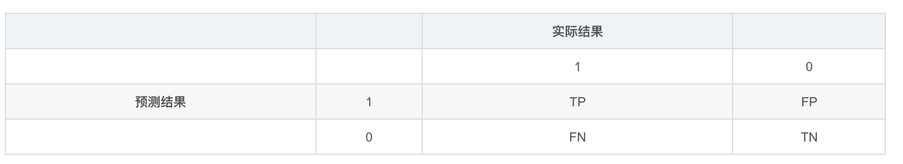

# 评测指标(metrics)
metric主要用来评测机器学习模型的好坏程度,不同的任务应该选择不同的评价指标,分类,回归和排序问题应该选择不同的评价函数. 不同的问题应该不同对待,即使都是分类问题也不应该唯评价函数论,不同问题不同分析.

## 回归(Regression)
### 平均绝对误差(MAE)

平均绝对误差MAE（Mean Absolute Error）又被称为 L1范数损失。
$$
MAE=\frac{1}{n}\sum_{i=1}^{n}|y_i-\hat{y}_i| \tag{3}
$$
MAE虽能较好衡量回归模型的好坏，但是绝对值的存在导致函数不光滑，在某些点上不能求导，可以考虑将绝对值改为残差的平方，这就是均方误差。

### 均方误差(MSE)

均方误差MSE（Mean Squared Error）又被称为 L2范数损失 。
$$
MSE=\frac{1}{n}\sum_{i=1}^{n}(y_i-\hat{y}_i)^2 \tag{1}
$$
由于MSE与我们的目标变量的量纲不一致，为了保证量纲一致性，我们需要对MSE进行开方 。

### 均方根误差(RMSE)
$$
RMSE=\sqrt{\frac{1}{n}\sum_{i=1}^{n}(y_i-\hat{y}_i)^2} \tag{2}
$$


### R2_score

$$
R2\_score =1-\frac{\sum^n_{i}\left(y_{i}-\hat{y}\right)^{2} / n}{\sum^n_{i}\left(y_{i}-\bar{y}\right)^{2} / n}=1-\frac{M S E}{\operatorname{Var}}	\tag{4}
$$


$R2\_score$又称决定系数，表示反应因变量的全部变异能通过数学模型被自变量解释的比例, $R2\_score$越大，模型准确率越好。

$y$表示实际销量,$\hat{y}$表示预测销量,$\bar{y}$表示实际销量的均值,$n$表示样本数,$i$表示第$i$个样本。$Var$表示实际值的方差，也就是销量的变异情况。

$MSE$表示均方误差，为残差平方和的均值,该部分不能能被数学模型解释的部分,属于不可解释性变异。

因此：
$$
可解释性变异占比 = 1-\frac{不可解释性变异}{整体变异}= 1-\frac{M S E}{\operatorname{Var}} = R2\_score	\tag{5}
$$


## 分类(Classification)
### 准确率和错误率


$$
Acc(y,\hat{y})=\frac{1}{n}\sum_{i=1}^{n}y_i=\hat{y_i} \tag{5}
$$

$$
Error(y, \hat{y})=1-acc(y,\hat{y}) \tag{6}
$$
Acc与Error平等对待每个类别，即每一个样本判对 (0) 和判错 (1) 的代价都是一样的。使用Acc与Error作为衡量指标时，需要考虑样本不均衡问题以及实际业务中好样本与坏样本的重要程度。

### 混淆矩阵
对于二分类问题,可将样例根据其真是类别与学习器预测类别的组合划分为：

```
真正例(true positive, TP):预测为 1，预测正确，即实际 1
假正例(false positive, FP):预测为 1，预测错误，即实际 0
真反例(ture negative, TN):预测为 0，预测正确，即实际 0
假反例(false negative, FN):预测为 0，预测错误，即实际 1
```

则有:TP+FP+TN+FN=样例总数. 分类结果的混淆矩阵(confusion matrix)如下:



###  准确率（查准率） Precision

Precision 是分类器预测的正样本中预测正确的比例，取值范围为[0,1]，取值越大，模型预测能力越好。
$$
P=\frac{TP}{TP+FP} \tag{7}
$$

### 召回率（查全率）Recall

Recall 是分类器所预测正确的正样本占所有正样本的比例，取值范围为[0,1]，取值越大，模型预测能力越好。
$$
R=\frac{TP}{TP+FN} \tag{8}
$$


### F1 Score

Precision和Recall 是互相影响的，理想情况下肯定是做到两者都高，但是一般情况下Precision高、Recall 就低， Recall 高、Precision就低。为了均衡两个指标，我们可以采用Precision和Recall的加权调和平均（weighted harmonic mean）来衡量，即F1 Score
$$
\frac{1}{F_1}=\frac{1}{2} \cdot (\frac{1}{P}+\frac{1}{R}) \tag{9}
$$

$$
F_1=\frac{2*P*R}{P+R} \tag{10}
$$


### ROC         
ROC全称是"受试者工作特征"(Receiver Operating Characteristic)曲线. ROC曲线为 FPR 与 TPR 之间的关系曲线，这个组合以 FPR 对 TPR，即是以代价 (costs) 对收益 (benefits)，显然收益越高，代价越低，模型的性能就越好。 其中ROC曲线的横轴是"假正例率"(False Positive Rate, **FPR**), 纵轴是"真正例率"(True Positive Rate, **TPR**), **注意这里不是上文提高的P和R**. 

- y 轴为真阳性率（TPR）：在所有的正样本中，分类器预测正确的比例（等于Recall）

$$
TPR=\frac{TP}{TP+FN} \tag{11}
$$

- x 轴为假阳性率（FPR）：在所有的负样本中，**分类器预测错误的比例**


$$
FPR=\frac{FP}{TN+FP} \tag{12}
$$


现实使用中,一般使用有限个测试样例绘制ROC曲线,此时需要有有限个(真正例率,假正例率)坐标对. 绘图过程如下:
1. 给定$m^+$个正例和$m^-$个反例,根据学习器预测结果对样例进行排序,然后将分类阈值设为最大,此时真正例率和假正例率都为0,坐标在(0,0)处,标记一个点.
2. 将分类阈值依次设为每个样本的预测值,即依次将每个样本划分为正例.
3. 假设前一个坐标点是(x,y),若当前为真正例,则对应坐标为$(x,y+\frac{1}{m^+})$, 若是假正例,则对应坐标为$(x+\frac{1}{m^-}, y)$
4. 线段连接相邻的点.

ROC曲线如下图(其中对角线对应于"随机猜测"模型):


### AUC

为了进行比较,较为合理的判别依据是ROC曲线下面的面积,即AUC(Area Under ROC Curve). 从上图看出,AUC可估算为:
$$
AUC=\frac{1}{2}\sum_{i=1}^{m-1}(x_{i+1}-x_i)\cdot(y_i+y_{i+1}) \tag{13}
$$


AUC考虑是样本排序的质量,因此它和排序误差有紧密联系.给定$m^+$个正例和$m^-$个负例,另$D^+$和$D^-$分别表示正和反例的集合,则排序损失定义为:
$$
l_{rank}=\frac{1}{m^+m^-}\sum_{x^+ \in D^+}\sum_{x^- \in D^-}(I(f(x^+)<f(x^-))+\frac{1}{2}I(f(x^+)=f(x^-))) \tag{14}
$$


即考虑每一对正反例,若正例的预测值小于反例,则记一个"罚分", 若相等,则记0.5个"罚分". 其实$l_{rank}$对应的是ROC曲线之上的面积,则有:

$$
AUC=1-l_{rank} \tag{15}
$$

### KS Kolmogorov-Smirnov

KS值是在模型中用于**区分预测正负样本分隔程度**的评价指标，一般应用于金融风控领域。与ROC曲线相似，ROC是以FPR作为横坐标，TPR作为纵坐标，通过改变不同阈值，从而得到ROC曲线。ks曲线为TPR-FPR，ks曲线的最大值通常为ks值。可以理解TPR是收益，FPR是代价，ks值是收益最大。图中绿色线是TPR、蓝色线是FPR。


### CTR（Click-Through-Rate）

CTR即点击通过率,是互联网广告常用的术语,指网络广告（图片广告/文字广告/关键词广告/排名广告/视频广告等）的点击到达率,即该广告的实际点击次数（严格的来说,可以是到达目标页面的数量）除以广告的展现量(Show content).
$$
ctr=\frac{点击次数}{展示量}　\tag{16}
$$


### CVR    (Conversion Rate)

CVR即转化率。是一个衡量CPA广告效果的指标，简言之就是用户点击广告到成为一个有效激活或者注册甚至付费用户的转化率.
$$
cvr=\frac{点击量}{转化量}　\tag{17}
$$


# 参考
1. 周志华 西瓜书
2. 李航 统计学习方法
3. https://baike.baidu.com/item/CVR/20215345
4. https://baike.baidu.com/item/CTR/10653699?fr=aladdin
5. https://www.cnblogs.com/shenxiaolin/p/9309749.html
