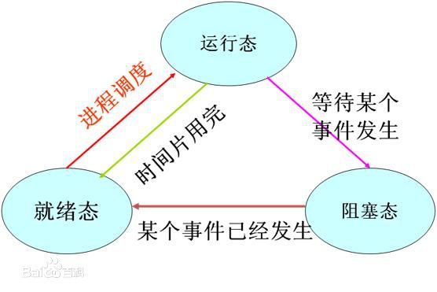

# 操作系统

## 1. 进程
**定义**        
    
    进程（Process）是计算机中的程序关于某数据集合上的一次运行活动，是系统进行资源分配和调度的基本单位，是操作系统结构的基础。在早期面向进程设计的计算机结构中，进程是程序的基本执行实体；在当代面向线程设计的计算机结构中，进程是线程的容器。程序是指令、数据及其组织形式的描述，进程是程序的实体。

    进程的概念主要有两点：第一，进程是一个实体。每一个进程都有它自己的地址空间，一般情况下，包括文本区域（text region）、数据区域（data region）和堆栈（stack region）。文本区域存储处理器执行的代码；数据区域存储变量和进程执行期间使用的动态分配的内存；堆栈区域存储着活动过程调用的指令和本地变量。第二，进程是一个“执行中的程序”。程序是一个没有生命的实体，只有处理器赋予程序生命时（操作系统执行之），它才能成为一个活动的实体，我们称其为进程。

**特征**        

    动态性：进程的实质是程序在多道程序系统中的一次执行过程，进程是动态产生，动态消亡的。
    
    并发性：任何进程都可以同其他进程一起并发执行    
    
    独立性：进程是一个能独立运行的基本单位，同时也是系统分配资源和调度的独立单位；
    
    异步性：由于进程间的相互制约，使进程具有执行的间断性，即进程按各自独立的、不可预知的速度向前推进
    
    结构特征：进程由程序、数据和进程控制块三部分组成。
    
    多个不同的进程可以包含相同的程序：一个程序在不同的数据集里就构成不同的进程，能得到不同的结果；但是执行过程中，程序不能发生改变。

**切换**        

    进行进程切换就是从正在运行的进程中收回处理器，然后再使待运行进程来占用处理器。

**状态**

    进程的三个基本状态
    进程执行时的间断性，决定了进程可能具有多种状态。事实上，运行中的进程可能具有以下三种基本状态。
    1）就绪状态（Ready）：
    进程已获得除处理器外的所需资源，等待分配处理器资源；只要分配了处理器进程就可执行。就绪进程可以按多个优先级来划分队列。例如，当一个进程由于时间片用完而进入就绪状态时，排入低优先级队列；当进程由I/O操作完成而进入就绪状态时，排入高优先级队列。
    2）运行状态(Running)：
    进程占用处理器资源；处于此状态的进程的数目小于等于处理器的数目。在没有其他进程可以执行时(如所有进程都在阻塞状态)，通常会自动执行系统的空闲进程。
    3）阻塞状态(Blocked)：
    由于进程等待某种条件（如I/O操作或进程同步），在条件满足之前无法继续执行。该事件发生前即使把处理器资源分配给该进程，也无法运行。

## 2. 线程
**定义**        

    线程（英语：thread）是操作系统能够进行运算调度的最小单位。它被包含在进程之中，是进程中的实际运作单位。一条线程指的是进程中一个单一顺序的控制流，一个进程中可以并发多个线程，每条线程并行执行不同的任务。在Unix System V及SunOS中也被称为轻量进程（lightweight processes），但轻量进程更多指内核线程（kernel thread），而把用户线程（user thread）称为线程。    

**特点**    

    线程的使用
    在多线程OS中，通常是在一个进程中包括多个线程，每个线程都是作为利用CPU的基本单位，是花费最小开销的实体。线程具有以下属性。
    1）轻型实体
    线程中的实体基本上不拥有系统资源，只是有一点必不可少的、能保证独立运行的资源。
    线程的实体包括程序、数据和TCB。线程是动态概念，它的动态特性由线程控制块TCB（Thread Control Block）描述。TCB包括以下信息：
    （1）线程状态。
    （2）当线程不运行时，被保存的现场资源。
    （3）一组执行堆栈。
    （4）存放每个线程的局部变量主存区。
    （5）访问同一个进程中的主存和其它资源。
    用于指示被执行指令序列的程序计数器、保留局部变量、少数状态参数和返回地址等的一组寄存器和堆栈。
    2）独立调度和分派的基本单位。
    在多线程OS中，线程是能独立运行的基本单位，因而也是独立调度和分派的基本单位。由于线程很“轻”，故线程的切换非常迅速且开销小（在同一进程中的）。
    3）可并发执行。
    在一个进程中的多个线程之间，可以并发执行，甚至允许在一个进程中所有线程都能并发执行；同样，不同进程中的线程也能并发执行，充分利用和发挥了处理机与外围设备并行工作的能力。
    4）共享进程资源。
    线程在同一进程中的各个线程，都可以共享该进程所拥有的资源，这首先表现在：所有线程都具有相同的地址空间（进程的地址空间），这意味着，线程可以访问该地址空间的每一个虚地址；此外，还可以访问进程所拥有的已打开文件、定时器、信号量机构等。由于同一个进程内的线程共享内存和文件，所以线程之间互相通信不必调用内核。

**进程 vs 线程**

    进程是资源分配的基本单位。所有与该进程有关的资源，都被记录在进程控制块PCB中。以表示该进程拥有这些资源或正在使用它们。
    另外，进程也是抢占处理机的调度单位，它拥有一个完整的虚拟地址空间。当进程发生调度时，不同的进程拥有不同的虚拟地址空间，而同一进程内的不同线程共享同一地址空间。
    与进程相对应，线程与资源分配无关，它属于某一个进程，并与进程内的其他线程一起共享进程的资源。
    线程只由相关堆栈（系统栈或用户栈）寄存器和线程控制表TCB组成。寄存器可被用来存储线程内的局部变量，但不能存储其他线程的相关变量。

    线程与进程的区别可以归纳为以下4点：
    1）地址空间和其它资源（如打开文件）：进程间相互独立，同一进程的各线程间共享。某进程内的线程在其它进程不可见。
    2）通信：进程间通信IPC，线程间可以直接读写进程数据段（如全局变量）来进行通信——需要进程同步和互斥手段的辅助，以保证数据的一致性。
    3）调度和切换：线程上下文切换比进程上下文切换要快得多。
    4）在多线程OS中，线程不是一个可执行的实体。

## 3. 死锁
**定义**

    死锁是指两个或两个以上的进程在执行过程中，由于竞争资源或者由于彼此通信而造成的一种阻塞的现象，若无外力作用，它们都将无法推进下去。此时称系统处于死锁状态或系统产生了死锁，这些永远在互相等待的进程称为死锁进程。

    死锁的规范定义：集合中的每一个进程都在等待只能由本集合中的其他进程才能引发的事件，那么该组进程是死锁的。

**条件**

    死锁的发生必须具备以下四个必要条件。
    1）互斥条件：指进程对所分配到的资源进行排它性使用，即在一段时间内某资源只由一个进程占用。如果此时还有其它进程请求资源，则请求者只能等待，直至占有资源的进程用毕释放。
    2）请求和保持条件：指进程已经保持至少一个资源，但又提出了新的资源请求，而该资源已被其它进程占有，此时请求进程阻塞，但又对自己已获得的其它资源保持不放。
    3）不剥夺条件：指进程已获得的资源，在未使用完之前，不能被剥夺，只能在使用完时由自己释放。
    4）环路等待条件：指在发生死锁时，必然存在一个进程——资源的环形链，即进程集合{P0，P1，P2，···，Pn}中的P0正在等待一个P1占用的资源；P1正在等待P2占用的资源，……，Pn正在等待已被P0占用的资源。

**产生原因**

    1. 竞争资源引起进程死锁
    当系统中供多个进程共享的资源如打印机、公用队列的等，其数目不足以满足诸进程的需要时，会引起诸进程对资源的竞争而产生死锁。
    2. 可剥夺资源和不可剥夺资源
    3. 竞争不可剥夺资源
    4. 竞争临时资源

**预防**

    只要打破四个必要条件之一就能有效预防死锁的发生：打破互斥条件：改造独占性资源为虚拟资源，大部分资源已无法改造。打破不可抢占条件：当一进程占有一独占性资源后又申请一独占性资源而无法满足，则退出原占有的资源。打破占有且申请条件：采用资源预先分配策略，即进程运行前申请全部资源，满足则运行，不然就等待，这样就不会占有且申请。打破循环等待条件：实现资源有序分配策略，对所有设备实现分类编号，所有进程只能采用按序号递增的形式申请资源。

    1. 有序资源分配法
    2. 银行家算法

## 4. 分页和分段有什么区别

+ 段是信息的逻辑单位，它是根据用户的需要划分的，因此段对用户是可见的
+ 页是信息的物理单位，是为了管理主存的方便而划分的，对用户是透明的
+ 段的大小不固定，有它所完成的功能决定；页大大小固定，由系统决定
+ 段向用户提供二维地址空间；页向用户提供的是一维地址空间
+ 段是信息的逻辑单位，便于存储保护和信息的共享，页的保护和共享受到限制

## 5. 进程间通讯的方式

+ **管道**：管道中还有命名管道和非命名管道之分，非命名管道只能用于父子进程通讯，命名管道可用于非父子进程，命名管道就是FIFO，管道是先进先出的通讯方式。FIFO是一种先进先出的队列。它类似于一个管道，只允许数据的单向流动。每个FIFO都有一个名字，允许不相关的进程访问同一个FIFO，因此也成为命名管。
+ **消息队列**：是用于两个进程之间的通讯，首先在一个进程中创建一个消息队列，然后再往消息队列中写数据，而另一个进程则从那个消息队列中取数据。需要注意的是，消息队列是用创建文件的方式建立的，如果一个进程向某个消息队列中写入了数据之后，另一个进程并没有取出数据，即使向消息队列中写数据的进程已经结束，保存在消息队列中的数据并没有消失，也就是说下次再从这个消息队列读数据的时候，就是上次的数据！！！
+ **信号量**：不能传递复杂消息，只能用来同步
+ **共享内存**：只要首先创建一个共享内存区，其它进程按照一定的步骤就能访问到这个共享内存区中的数据，当然可读可写；

**比较**：
+ 管道：速度慢，容量有限
+ 消息队列：容量受到系统限制，且要注意第一次读的时候，要考虑上一次没有读完数据的问题。
+ 信号量：不能传递复杂消息，只能用来同步
+ 共享内存区：能够很容易控制容量，速度快，但要保持同步，比如一个进程在写的时候，另一个进程要注意读写的问题，相当于线程中的线程安全，当然，共享内存区同样可以用作线程间通讯，不过没这个必要，线程间本来就已经共享了一块内存的。

**待续...**

# 参考
1. https://baike.baidu.com/item/%E6%AD%BB%E9%94%81
2. https://baike.baidu.com/item/%E7%BA%BF%E7%A8%8B
3. https://baike.baidu.com/item/%E8%BF%9B%E7%A8%8B/382503?fr=aladdin
4. https://blog.csdn.net/gui951753/article/details/79489748
5. 